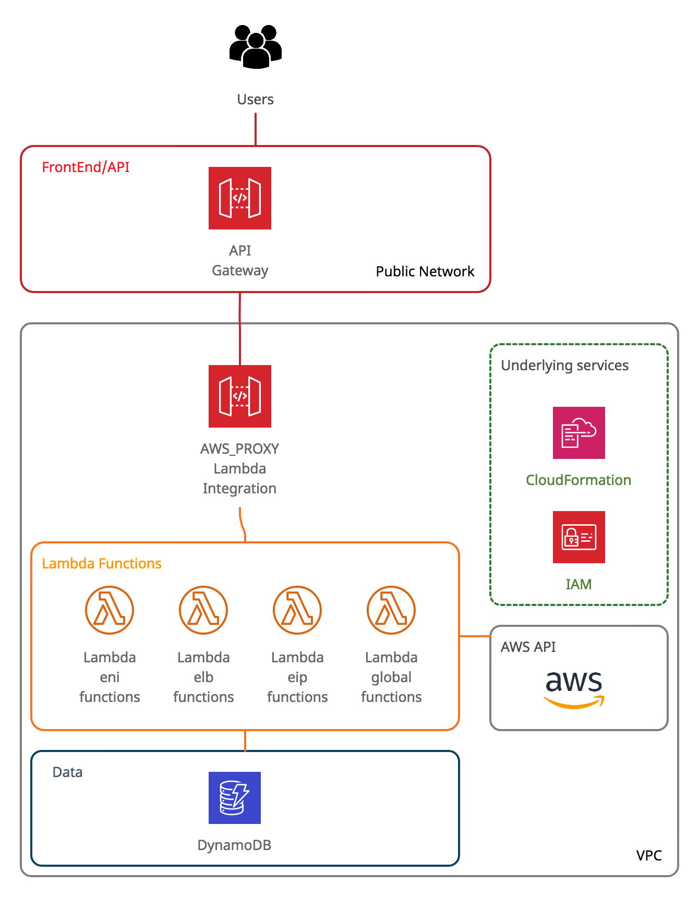

## idle resource checker

### Table of contents:
  * [Abstract](#abstract)
  * [Assumptions and requirements](#assumptions-and-requirements)
  * [Tool/Libraries usage](#tool-libraries-usage)
  * [Architecture Diagram](#architecture-diagram)
  * [Deployment pipeline and testing with make file](#deployment-pipeline-and-testing-with-make-file)
  * [Folder structure](#folder-structure)
  * [API Endpoints](#api-endpoints)
  * [Naming conventions](#naming-conventions)
  * [Unit testing](#unit-testing)
  * [Technical decisions](#technical-decisions)
  * [Pending tasks](#pending-tasks)
  * [Known issues](#known-issues)
  * [Moving to production and possible upgrades](#moving-to-production-and-possible-upgrades)

### Abstract
This document tries to explain the application workflow, set up and configuration of Idle Resource Checker.
AWS Serverless solution based on API Gateway, Lambda and DynamoDB, managed as a code by a cloudformation stack or a terraform manifest.
The different lambda functions, uses python and Amazon API (boto3) to search for idle resources (Elastic Public IPs, Network interfaces or Load Balancers) that are not in use, storing the results on a DynamoDB table.
The results in the DynamoDB and the scans and CRUD operations can be triggered though different API Gateway endpoints.
- The workflow is managed by a Makefile
- Lambda is using python3 and additional libraries (json, boto3, datetime, etc...)
- Lambda deploy is managed by CloudFormation template or terraform manifest and its custom modules
- Testing is done by python inittest or by curl commands

### Assumptions and requirements
Running the Makefile assumes:
- aws cli installed, with credentials with access and rights to create CloudFormation stacks and needed resources (deploy)
- python3 virtualenv and pip3 installed and PATH accessible (for inittest)
- terraform binary installed (for terraform deploys)
- you have access to internet (pip3 and terraform repositories) (for downloading public libraries)
- other tools like make, curl and zip and awk installed and PATH accessible

**Additional notes:**
- The deployed solution uses some AWS services out of free tier, please, be aware

### Tool/Libraries usage
The following tools and AWS services has been used:
- Serverless services
    - AWS Cloudformation # _creating all resources needed, code defined_
    - DynamoDB database # _NonSQL DB storing idle resources records_
    - AWS Lambda # _serverless functions running the scans and CRUD operations_
    - AWS API Gateway # _serverless REST API implementing different endpoins_
    - AWS IAM roles and policies # _managing and restricting lambda execution permissions_
- Deploy
    - cloudformation      _# implementing resources stacks defined in "infra-cf" folder_
    - aws cli             _# creating and listing resources, uploading lambda code_
    - terraform [1.1.3]   _# deploying necessary resources with custom terraform modules on "infra-tf" module_
    - terraform modules and providers (and it's dependencies)
      - hashicorp/aws     _# provider plugin managing aws ecs and lambda deploys_
- Testing
    - python [3.9]       _# running main unittest function code_
    - python pip modules (and it's dependencies)
        - boto3/botocore _# AWS SDK interacting with AWS resources_
        - datetime      _# getting datestamp on lambda scan functions_
        - requests      _# interacting api-gateway AWS resources_
        - json          _# managing requests json fields_
        - jsonschema    _# parsing and validating api responses_
        - pytest        _# managing unit test cases_
        - unittest      _# implementing unit test cases response checks_
        - virtualenv    _# creating temporal python virtual environment_

Please, find the tools, diferences and similarities used for each Makefile rule on the following table
|                           | all-cf                     | all-tf                   |
|---------------------------|----------------------------|--------------------------|
| build                     | zip + pip3 install         | zip + pip3 install       |
| deploy                    | CloudFormation             | Terraform                |
| lambda code upload        | aws cli                    | Terraform                |
| policies definition       | embedded on yaml template  | polcies json files       |
| test-*-listing            | aws cli                    | Terraform + aws cli      |
| test-generate             | aws cli                    | aws cli                  |
| test-apigateway-curl      | curl                       | curl                     |
| test-apigateway-inittest  | python3 + inittest         | python3 + inittest       |
| clean-*                   | aws cli                    | Terraform                |
| resources tagging         | "AWS application"          | ecs-updater-terraform    |
| parameters                | none                       | variables.tf             |
| resources creation        | static code                | dynamically based on variables |
| code structure            | one static file            | splitted on modules      |
| state management          | AWS managed                | local tfstate file       |

### Architecture Diagram
Solution architec is as follows


### Deployment pipeline and testing with make file
The following stages has been defined on the [Makefile](MakeFile)
- **make all-cf** _(< 5m)_
	runs sequentially all the workflow for AWS using CloudFormation yaml definitions and aws cli uploading files
- **make all-tf** _(< 4m)_
	runs sequentially all the workflow for AWS using terraform custom modules
- **make build** _(< 5s)_
    builds lambda bundles (.zip files) to be uploaded to aws
- **make deploy-cf** _(< 2m)_
	creates of all the needed resources on AWS account using CloudFormation
- **make deploy-tf** _(< 2m)_
	creates of all the needed resources on AWS account using Terraform
- **make test-cf-listing** _(< 10s)_
	lists the resources generated for cloudformation stack on aws account using "aws cli" commands
- **make test-tf-listing** _(< 10s)_
	lists the resources generated for cloudformation stack on aws account using "aws cli" commands
- **make test-generate** _(< 10s)_
	generates different dummy idle resources (ENIs, LoadBalancer and EIPs) on AWS account for testing propouses
- **make test-apigateway-curl** _(< 40s)_
	launching apigateway endpoints for ENIs (`<API_BASE_URL>/enis-scan`), LoadBalancer (`<API_BASE_URL>/elbs-scan`), EIPs (`<API_BASE_URL>/eips-scan`) and Global (`<API_BASE_URL>/global-scan`) scans and shows the results
- **make test-apigateway-inittest** _(< 15s)_
	launching apigateway endpoints on AWS using python3 inittest
- **make clean-cf** _(< 1m)_
	deletes the created cloudformation stack
- **make clean-tf** _(< 30s)_
	deletes the created terraform resources

### Folder structure
Templates, modules and scripts has been distributed as follows:
```
├── api_exports     _# folder containing Swagger OpenID schema definition and Postman files for API Gateway endpoints implementation_
├── infra-cf        _# folder containing CloudFormation templates (json and yaml), defining all needed resources_
├── infra-tf        _# folder containing terraform modules and resources definition_
    ├── modules/idle-resource-checker_apigateway  _# terraform custom configuration module setting up api gateway_
    ├── modules/idle-resource-checker_dynamodb    _# terraform custom configuration module setting up DynamoDB table_
    ├── modules/idle-resource-checker_lambda      _# terraform custom configuration module setting up lambda functions_
    ├── main.tf      _# main configuration file_
    ├── outputs.tf   _# defining terraform output after execution_
    ├── provider.tf  _# necessary configuration file using official aws provider_
    └── variables.tf _# defining parameters to read from different modules_                
├── lambda_code       _# folder containing lambda functions code to be uploaded_
├── policies          _# folder containing needed roles and policies for lambda execution. Json files are read from Terraform modules_
├── scripts           _# folder containing build, deploy and wrap-up scripts used for Makefile_
├── testing           _# folder containing testing necessary events, scripts and json for testing_
    ├── events        _# folder containing json entry events. stored only for archive and testing propouses_
    ├── generate_idle_resources.sh        _# script generating dummy eips, load balancer and enis with aws-cli for test cases_
    ├── inittest-validation               _# folder containing python inittest scripts and json files defining test to run and schema validations_
    ├── listing_cf_resources.sh           _# script listing all created resources by using aws cli commands_
    ├── listing_tf_resources.sh           _# script listing all created resources by using aws cli commands_
    ├── run-apigateway-tests-curl.sh      _# script running sequentially apigateway test on aws using curl commands_
    └── run-apigateway-tests-inittest.sh  _# script running sequentially apigateway test on aws, defined by json files on "inittest-validation" folder using inittest python3 class_
├── README.rd         _# project documentation_
└── Makefile          _# Makefile defining the workflow deploying, testing, and wrapping up the application
```
**Additional notes:**
- lambda folder contains lambda version after and before API Gateway implementation (.v0_BeforeAPIGateway.py / .py), reading payload from event['body']
- zip bundles to be updated to aws are dynamically generated inside lambda folder on "make build" step
- json policies under "policies" folder are being read by terraform modules. Is not in used for any deploy script, CloudFormation has these contents integrated

### API Endpoints
All previous endpoint URLs and methods can be accessed by HTTPS
- **API_BASE_URL/eips-***          _# main elastic IPs API path operations_
    - GET       `/eips-get`      _# retrieves the stored elastic IPs entries in DynamoDB_
    - DELETE    `/eips-delete`   _# deletes a specific elastic IPs (from AWS account and DynamoDB)_
    - GET       `/eips-scan`     _# triggers elastic IPs scan function, storing results in DynamoDB_
- **API_BASE_URL/elbs-***          _# main load balancer API path operations_
    - GET       `/elbs-get`      _# retrieves the stored load balancer entries in DynamoDB_
    - DELETE    `/elbs-delete`   _# deletes a specific load balancer (from AWS account and DynamoDB)_
    - GET       `/elbs-scan`     _# triggers load balancer scan function, storing results in DynamoDB_
- **API_BASE_URL/enis-***          _# main network interfaces API path operations_
    - GET       `/enis-get`      _# retrieves the stored network interfaces entries in DynamoDB_
    - DELETE    `/enis-delete`   _# deletes a specific eni (from AWS account and DynamoDB)_
    - GET       `/enis-scan`     _# triggers enis scan function, storing results in DynamoDB_
- **API_BASE_URL/global***      _# generic endpoints for operation in all resources_
    - GET       `/global-get`    _# dumping all DynamoDB contents_
    - GET       `/global-scan`   _# triggering all other resources scans (eip-scan, elb-scan, eni-scan)_
    - DELETE    `/global-delete` _# resetting (delete + create) DynamoDB table, nothing on AWS accounts_

**Note:** Please, find a deeper documentation on api_exports folder, containing Swagger OpenID schema definition and Postman files for API Gateway endpoints implementation

### Naming conventions
The following naming convetions has been followed:

| resource                  | name                                                  | defined in                                  | example |
|---------------------------|-------------------------------------------------------|---------------------------------------------|------------|
| lambda function           | idle-resource-checker-lambda_<RESOURCE_NAME>-<ACTION> | zip + pip3 install                          | idle-resource-checker-lambda_elbs-scan |
| policies name             | idle-resource-checker-<RESOURCE_NAME>-<READ/WRITE>    | CloudFormation teamplate / Terraform module | idle-resource-checker-lambda-policy_elbs-write |
| policies json filename    | policy-<RESOURCE_NAME>-<R/W>.json                     | Terraform module + policies folder          | [policy-elbs-w.json](policies/policy-elbs-w.json) |
| roles name                | idle-resource-checker-*-role_<RESOURCE_NAME>-<ACTION> | CloudFormation template / Terraform module  | idle-resource-checker-lambda-role_elbs-scan |
| api endpoints             | <RESOURCE_NAME>-<ACTION>                              | CloudFormation teamplate / Terraform module | `elbs-scan` |
| terraform modules name    | idle-resource-checker_<MODULE_NAME>                   | infra-tf/main.tf file and and modules folder | [idle-resource-checker_apigateway](infra-tf/modules/idle-resource-checker_apigateway) |

**Additional notes:**
- During automation, last part of lambda name, will be read as API Gateway path suffix (eips-scan, elbs-get, etc...).
- Some names, even are following a common criteria, are hardcoded on some automations and not yet paramettried in a variable

### Unit testing
Unit testing has been implemented with the following characteristics:
- using python3 class, creating a [subtests](https://docs.python.org/3/library/unittest.html#distinguishing-test-iterations-using-subtests) for each case  with different AssertEqual/AssertTrue validations
- python class is running on an isolated virtual environment created by virtualenv, and it's deleted after that
- non default verbosity and "short test summary info" table has been added using "-v -rA" command line switches
- tests iterations from tests cases and expected responses has been splitted/decoupled. Inittest python class _inittest_validation.py_ is reading parameters from json files (ie: [eips_tests.json](policies/eips_tests.json)). On these way creating test cases for future resources is easer and follows best pracices.
- An identification (`testID`) for each case test has been added, for a better identification (ie: `[ EIPs 1.2 SCAN EIPs ]`)
- notification messages has been added on ["msg" subtest parameter](https://docs.python.org/3/library/unittest.html#unittest.TestCase.subTest) for a better results visualization
- unittest assumes an empty DynamoDB table, and some dummy resources creation (`make test-generate`).
- tests are running sequencially on the json order, making possible assumption for some test_cases like multiple entries checks, delete before insert, etc...
- unittest cases deletes all found resources, making the execution idempotent
- specific test cases has been splitted on different assert validations due the response given (null, json, string, etc...)
- for existent resources, instead of comparing literal response text, json validation has been implemented. On these way tricky fileds like `account` or `available_from` are easier check.
- idle-resouce-checker state (the DynamoDB table) can be reset at any time by using `curl -X DELETE <API_BASE_URL>/global-delete`
- On json schema validation method, a trivial try/catch has been implemented, due non native boolean method on jsonvalidation library

### Technical decisions
The following decisions has been considered during the implementation:
- DB
    * Due the different possible fileds for each resource, using as NO-SQL database for its colums flexibility.
    * Autoscaling disabled on DynamoDB (ReadCapacityUnits/WriteCapacityUnits) to still on free tier
    * Using "type" field as range KeyType, forcing partition scheme per type   
- Security
    * On Lambda functions, error exceptions has been cached (botocore.exceptions), thowing only 502 exit code message "Internal server error", avoiding show of internal details
    * Accessible only opened by 80/443 ports, on specific path suffix, and only one method per type is accepting parameters (`GET`/`DELETE`)
    * Policies` has been defined per read/write basics, decompling from roles for a more flexible mapping
    * Accessing roles to DynamoDB split into Read Only, Read-Write  and ReadWriteCreateDestroy, and restricted to the specific DynamoDB, minimizing attach surface
    * recreation permission role has only been granted to "global-delete" lambda role, minimizing risks
- IaaC
    * Implementation similarities between CloudFormation and Terraform
        * Final execution output (lambda arns, API Gateways URLs and DynamoDB table name) has been normalized between CloudFormation and Terraform
        * Same Roles, Policy and lambda names
        * Syntax validation (`aws cloudformation validate-template`/`terraform validate`) has been implemented before any apply
    * CloudFormation
        * Using yaml version of cloudformation template: due the 52000 kb limitation of "aws cloudformation deploy" command
        * Using Ireland "eu-west-1" zone, with the needed features and avoiding other zones overcost
    * Terraform
        * Resources creation has been splitted on 3 different modules (ApiGateway, DynamoDB and Lambda) for easier debugging and understanding
        * Code complexity on each module has been splitted creating local maps/variables and loops on each resource
        * All resources creation are being created dynamically though local dynamica variables (map and for loops), avoiding repeting same code multiple times
        * Output reources aregenerated dynamically though maps and for loops
        * Policies are read dynamically from policies folder, avoiding code harcodings
        * Global parameters, like actions and resources, has been grouped on root variables.tf file, avoiding modules overrides
        * including the permissions on each module, avoiding a resource dependencies mess
        * [data.tf](infra-tf/modules/idle-resource-checker_lambda/data.tf) file is needed only on "idle-resource-checker_lambda" module (to get aws account id, to generate lambda arn). Its needed only for that module, so has not beed added at root "infra-tf" level.
        * using `${path.module}` variable as a reference for relative paths for acessing necessary files (lambda .zip bundles and .json policies)
        * Code linting on terraform module ("terraform fmt")
- MakeFile
    * Echo a description of the running steps with the `[step name] Action...` has been added in all scripts
    * non-essential commands output verbosity has been limited, for a better console reading
    * Creation and deletion wait commands (aws cloudformation wait), avoiding sleep usage and raise conditions
    * A Makestep (`build`) has been created, creating lambda  bundle on the fly and avoiding having compressed and uncompressed version of the same file
    * different steps and scripts has been defined to implement CloudFormation and Terraform paths, for a better debugging and understanding
    * deleting only the necessary files on wrap-up, issues with `rm -rf *` commands
- Testing
    * API gateway URL parameter is updated dynamically by using "aws apigateway get-rest-apis" command
    * specific resources delete operations on curl testing has been commented due resources arn are dynamic. Storing get curl output and jq parsing can be implemented in the future making it possible.
- Lambda
    * 30 timeout set on each lambda function, forcing a and with compliance with API Gateway 30 seconds timeout limitation.
    * concurrency limit set to 1 (`ReservedConcurrentExecutions": 1`), avoiding multiple scan function executions and raise conditions
    * to trigger all scan operations, a generic lambda funcion has been implemented (`global-scan`). Instead of running each `scan lambda` function directly [boto3 lambda invoke](https://boto3.amazonaws.com/v1/documentation/api/latest/reference/services/lambda.html#Lambda.Client.invoke), a GET requests [requests python module](https://pypi.org/project/requests/) has been used, in order to avoid granting additional permissions to that lambda.
- Python code
    * Model created for ELB and ENI resources, following python best practices
    * Code linting on python code ("python -m pylint")
    * A [requriments.txt file](testing/inittest-validation/run-apigateway-tests-inittest_requirements.txt) has been created for virtualenv dependencies running inittes 

### Pending tasks
- Implement deep inittest for enis, elbs an global resources
- Migrate parameters reading in inttest from OS_ENVIRONMENT to parameters with [argparse](https://docs.python.org/3/howto/argparse.html)
- Finish [deploy from bucket](scripts/deploy_cf_from_bucket.sh) Cloudformation deploy version 
- Normalize same lambda permissions on Cloudformation than terraform on "idle-resource-checker-apigateway" module -> "aws_lambda_permission" -> source_arn
- Parametrize api gateway stage_name url `API_BASE_URL/resource-cleaner` (now harcoded on CloudFormation Template, "idle-resource-checker-apigateway_api-url-name" variable on terraform), into a Makefile variable + CloudFormation/Terraform command line parameters
- Parametrize CloudFormation template output with path_suffixes and ApiGateway stage_name

### Known issues
- global-scan lambda function is not working deployed with cloudformation, due lambda permissions
- with a loadbalancer created, that additional enis are listed, and cannot be deleted using "eni-delete" lambda

### Moving to production and possible upgrades
- IaaC
    * Tag all created resources using [resourcegroupstaggingapi](https://boto3.amazonaws.com/v1/documentation/api/latest/reference/services/resourcegroupstaggingapi.html), allowing cost searches and listing by tag
    * Split Cloudformation on 3 nested stacks (RolesAndPermissions, APIGateway, DynamoDB)
- API Gateway
    * Group same resources operation (eni-get, eni-scan, eni-delete) under the same endpoint (/eni)
    * Route 53 DNS aliases for the API gateway endpoint URL
    * Implement `/v1` on API path, allowing backwards compatibility in case of breaking changes
    * Add [DocumenationParts](https://docs.aws.amazon.com/AWSCloudFormation/latest/UserGuide/aws-resource-apigateway-documentationpart.html) for better exports and understanding
    * Parameter checking using WAF/Request Validator/models/python lambda function
    * Authentication based on [tokens](https://docs.aws.amazon.com/apigateway/latest/developerguide/api-gateway-lambda-authorizer-input.html)
- Documentation
    * Automate Swagger [api gateway export](https://docs.aws.amazon.com/apigateway/latest/developerguide/api-gateway-export-api.html), and integrate the exported yaml file with swagger ui [docker image](https://hub.docker.com/r/swaggerapi/swagger-ui) and using `API_BASE_URL` yaml parameter injection
    * Automate external postman files transformation to swagger files acessing to that API gateway using [p2o tool](https://joolfe.github.io/postman-to-openapi/)
- Testing
    * Automate delete operations on curl testing. Challenge is the dynamic arn generation. This can be sorted out by storing get curl output and jq parsing the needed value.
    * Amazon API validations using python boto3 library after CloudFormation deploy
    * Create a model on python3 inittest for each resource, avoiding passing multiple parameters between methods
    * Implement local lambda execution with [Serverless Application Model SAM framework](https://docs.aws.amazon.com/serverless-application-model/latest/developerguide/serverless-getting-started-hello-world.html),using "hello world" project as a boiler plate, and emulating ["host" and "body"](https://docs.aws.amazon.com/apigateway/latest/developerguide/set-up-lambda-proxy-integrations.html) json event fields
    * Implement local boto testing using [localstack](https://github.com/localstack/localstack) and local endpoint [endpoint_url](https://docs.aws.amazon.com/amazondynamodb/latest/developerguide/GettingStarted.Python.03.html)
    * Additional test cases
        * delete inexistent resource, with valid json
        * wrong json payload
        * inexistent endpoint
- Additional features
    * Implement an scheduler for lambda scan functions
    * Custom log formats to CloudWatch
    * Multiple AWS accounts support (assume role)
    * Delete resources older than a specific age (based on parameter)
    * HealthCheck endpoint checking DynamoDB availability and permissions
    * Additional reources/lambda functions
        * Idle instances
        * Idle EBS volumes
        * Idle backups (IE: RDS)
        * Idle IAM roles
        * Idle accounts/passwords (LastLogin)

